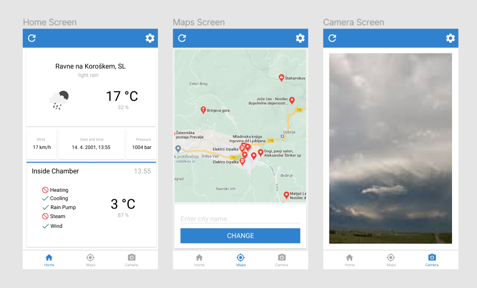

# Weather Chamber

> Api and mobile app for weather control inside chamber

Software part of weather chamber project including api built with Node.js, Express and mobile app fully created in React Native.



## Installation

Mobile app:

```sh
cd mobile
npm install
npm start
```

API:

```sh
cd api
npm install
npm run dev
```

## Usage

Project was built for Slovenian's best innovation competition. Goal was to simulate weather in chamber with mobile application. For example if we want to get London's weather in chamber we just have to change it to "London" in mobile application. Chamber will get weather data from OpenWeather API and compare it with data from chamber sensors. Based on that server part of app will control electronic relays (heating, cooling, rain pump, steam and wind).
